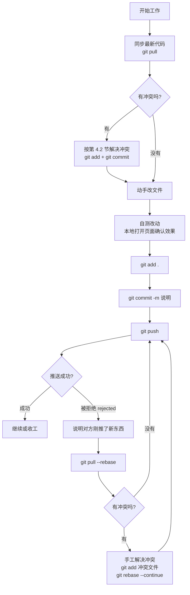
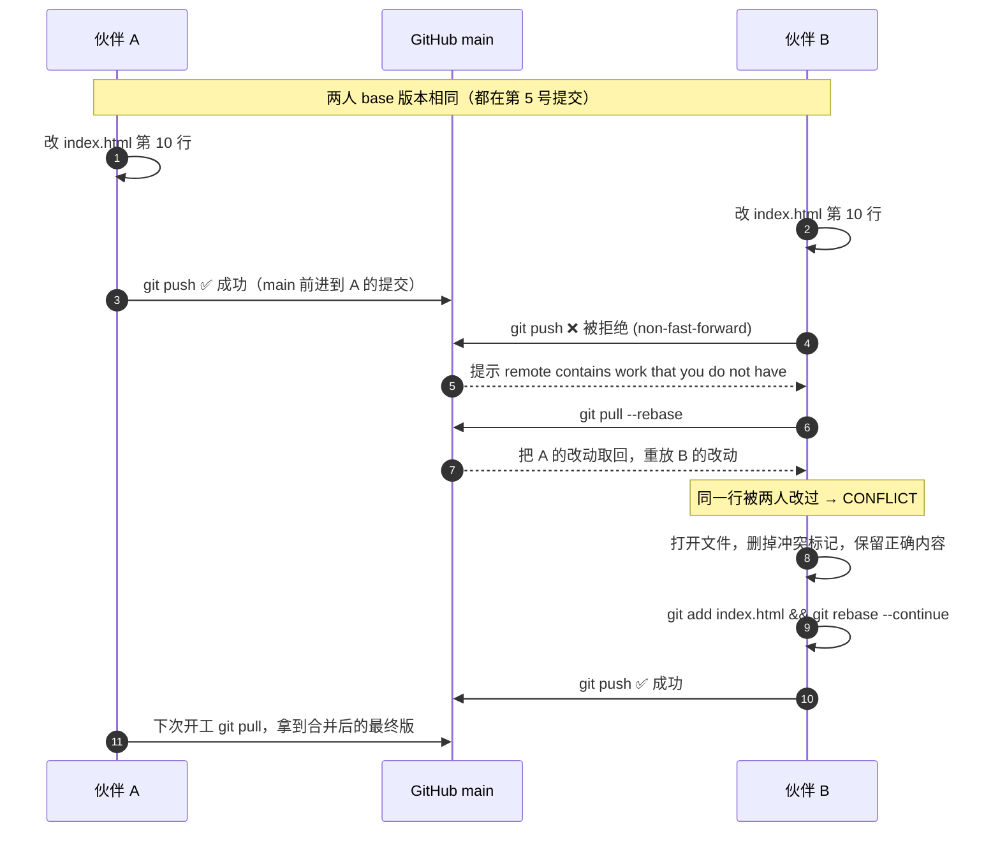

# 双人协同操作手册（同步原理 · 流程图 · 冲突处理）

> 适用仓库：`https://github.com/xiaoxingyuemiao/xingyue.git`（私有仓库，主分支 `main`）
> 本文是 `docs/03-协作指南.md` 的进阶篇：03 讲「第一次怎么装好」，本文讲「两个人日常怎么配合、撞车了怎么办」。
> 命令都可在 **Git Bash / PowerShell / 终端** 里直接执行。

---

## 一、双人协同到底是怎么协同的

### 1.1 三份仓库，别搞混

GitHub 协同的本质不是「两个人同时编辑同一份文件」，而是**三个仓库之间来回复制**：

| 位置 | 是什么 | 谁在用 |
| --- | --- | --- |
| **远程仓库** `origin` | GitHub 服务器上的那份，唯一权威版本 | 双方共用的「中转站」 |
| **本地仓库** `.git` | 你 clone 到电脑上的完整历史（含所有版本快照） | Git 在管 |
| **工作区** | 你能用编辑器打开、肉眼看到的真实文件 | 你在改 |

```
        伙伴A 电脑                       GitHub                       伙伴B 电脑
   ┌──────────────────┐          ┌──────────────────┐          ┌──────────────────┐
   │  工作区(文件)     │          │                  │          │  工作区(文件)     │
   │      ↕ add       │  push →  │   远程仓库 main   │  ← push  │      ↕ add       │
   │  本地仓库(.git)   │  ← pull  │  (唯一权威版本)   │  pull →  │  本地仓库(.git)   │
   └──────────────────┘          └──────────────────┘          └──────────────────┘
```

**关键认知**：两个人**永远不会**真正「同时编辑同一个文件」。你们各自在自己的电脑上改自己的副本，只有 `push` / `pull` 的那一瞬间才会有内容交换。所以「协同」= 管好 **推送时机** 和 **拉取时机**。

### 1.2 三个区域与三条命令的对应关系

```
工作区 ──git add──▶ 暂存区 ──git commit──▶ 本地仓库 ──git push──▶ GitHub
   ▲                                                                    │
   └────────────────────── git pull ◀───────────────────────────────────┘
```

- `git add .`：挑出这次要提交的改动（装进盒子）
- `git commit -m "说明"`：把盒子封上，留下一个**历史快照**（本地操作，不联网）
- `git push`：把本地快照上传到 GitHub
- `git pull`：把 GitHub 上的新快照下载并合并进本地（= `git fetch` + `git merge`）

### 1.3 为什么必须有「提交历史」这一层

因为它是**冲突能够被自动处理**的前提。Git 对比的是三个版本：

```
              共同祖先 (base)
             /              \
    你的改动 A              伙伴的改动 B
             \              /
              合并结果 (merge)
```

- 你改了第 10 行、伙伴改了第 50 行 → Git 自动合并，**无冲突**
- 你和伙伴都改了第 10 行且改得不一样 → Git 无法替你决定 → **冲突（CONFLICT）**，交给人来定

这就是下一节流程图要讲的全部内容。

---

## 二、同步流程图

### 2.1 主流程：一天的标准协同循环



### 2.2 分支视角：两人交替推送时，指针怎么走


> 正常配合下（每次改完立刻 push），历史是一条笔直的线，**天不会塌**。
> 只有当 A、B 都攒着不推、又都改了同一处时，才会长出真正的分叉。

### 2.3 双人「同时改同一文件并同时 push」的时序图

这是第 4 问的核心场景。关键在于 **GitHub 只认先到的那一个**，后到的那个必然被拒绝：



**一句话结论**：Git 不会静默覆盖任何人的东西。先推的人赢，后推的人**必须**先拉、解决冲突、再推。

---

## 三、日常同步的标准动作（照着做就行）

### 3.1 开工前：只做一条

```bash
git pull
```

看到 `Already up to date.` = 对方没动过，直接开工。
看到一堆 `Fast-forward` 和文件列表 = 同步到了对方的新改动，正常。

> ⚠️ 如果此时本地有你**还没提交**的改动，`git pull` 可能报错或弄乱状态。
> 稳妥做法：**先提交再拉**。
> ```bash
> git add . && git commit -m "WIP: 半成品先存一下"
> git pull
> ```

### 3.2 干活中：小步提交

每完成一个**能被描述清楚的小改动**就提交一次，不要攒一天：

```bash
git add .
git commit -m "首页轮播图换成星空主题"
```

提交说明写「**改了什么 + 为什么**」，不要写 `update`、`修改`、`111`。因为出冲突时，全靠这些说明判断该保留谁。

### 3.3 收工前：立刻推

```bash
git push
```

**「改完马上推」是双人协同最重要的一条纪律**——推得越勤，两人重叠的窗口越小，冲突越少。

### 3.4 想看看对方最近干了啥

```bash
# 只看远端有没有新东西（不改本地文件，安全）
git fetch origin
git log HEAD..origin/main --oneline

# 看每个人的提交历史
git log --oneline --graph --all -15

# 看某个文件最近被谁改过
git log --oneline -5 -- index.html

# 看自己改了哪几行（推送前自检）
git diff
```

### 3.5 日常命令速查表

| 我想…… | 命令 |
| --- | --- |
| 同步对方改动 | `git pull` |
| 看当前改了哪些文件 | `git status` |
| 看具体改了哪几行 | `git diff` |
| 提交全部改动 | `git add . && git commit -m "说明"` |
| 上传 | `git push` |
| 推送被拒 | `git pull --rebase` 然后 `git push` |
| 只看远端是否有更新 | `git fetch origin` |
| 撤销还没 `add` 的改动 | `git restore 文件名` |
| 撤销已 `add` 的改动 | `git restore --staged 文件名` |
| 查看冲突文件清单 | `git status`（看 `both modified`） |
| 放弃本地全部改动，硬同步远端 | `git fetch origin && git reset --hard origin/main` |

> ⚠️ `git reset --hard` 会**永久丢掉**你本地没提交的改动，只在确认自己不要了的时候用。

---

## 四、双方同时改了同一份文件，又同时推送了，怎么办

### 4.1 先理解：为什么一定有一个人的 push 会失败

Git 的 `push` 只允许「**在远端当前版本的基础上追加**」。前面 §2.3 的时序图已经说明：

- A 先 push 成功 → GitHub 的 `main` 已经前进到 A 的提交
- B 的本地历史还停在旧版本 → B 的 push 属于「分叉」，GitHub **必须拒绝**（报 `non-fast-forward`）

**这是保护机制，不是故障。** 它保证你的东西不会被无声覆盖。所以：

> 被拒绝 ≠ 你的代码丢了。你的提交**完好地躺在本地仓库里**，只需要补一步「先合并再推」。

### 4.2 处理流程（命令行，推荐）

```bash
# 第 1 步：把对方的改动拉下来，并把你的改动「叠」在最上面
git pull --rebase

# 第 2 步：看结果
#   情况一：提示 Successfully rebased → 无冲突，直接推
git push

#   情况二：提示 CONFLICT (content) → 有冲突，进入第 3 步
```

出现冲突后：

```bash
# 第 3 步：看哪些文件冲突了
git status
#   会列出 "both modified: xxx.html"

# 第 4 步：用编辑器打开冲突文件，找到这种标记：
#   <<<<<<< HEAD
#   伙伴的版本（远端已有的）
#   =======
#   你的版本
#   >>>>>>> 你的提交说明
#
#   把它改成你最终想要的样子：删掉 <<<<<<<、=======、>>>>>>> 这三行标记，
#   两边内容该留的留、该合的合、该删的删。注意别留下多余的半个标签。

# 第 5 步：标记为已解决
git add index.html

# 第 6 步：继续
git rebase --continue
#   如果后面还有别的文件冲突，重复第 3~6 步

#   ⚠ 常见坑：这一步可能突然弹出一个编辑器（Vim 黑屏界面）让你确认提交说明。
#     想直接沿用原来的说明、不弹编辑器：
git rebase --continue --no-edit
#     或者：git commit --no-edit
#     如果不小心进了 Vim 出不来：按 Esc，输入 :wq 再回车（保存退出）；
#     想放弃修改就输入 :q! 再回车。

# 第 7 步：本地打开页面确认效果没坏，然后推
git push
```

**中途想放弃，回到拉取之前：**

```bash
git rebase --abort
```

### 4.2.1 冲突时最容易卡住的几个点

| 卡住的点 | 现象 | 解决 |
| --- | --- | --- |
| 继续时弹出编辑器 | `git rebase --continue` 后进入黑屏 Vim 界面，不会退出 | 改用 `git rebase --continue --no-edit`；已经进去了就按 `Esc`，输入 `:wq` 回车 |
| 忘了 `git add` | `--continue` 报 `could not commit staged changes` | 先 `git add 冲突文件`，再 `--continue` |
| 冲突标记里混进了 BOM | 行首有个看不见的 ``，看着一样其实不一样 | 别整行复制粘贴，按需手工输入；用 `git diff` 复核 |
| 只删了标记却留了半截 | 页面显示异常 / 标签不闭合 | 搜一遍 `<<<<<<<`、`=======`、`>>>>>>>` 确保一个不剩 |
| 冲突文件很多 | `git status` 里一堆 `UU` | 别硬扛，`git rebase --abort` 回退后与伙伴商量由一人合并 |

> 上面这套流程已在本机用真实 Git 完整走通一遍：`CONFLICT (content)` → `git status` 显示 `UU`
> → 删标记 → `git add` → `--continue` → 历史变成一条直线、两边的改动都保留。

### 4.3 `--rebase` 和 `--no-rebase` 该选哪个

| 方式 | 命令 | 结果 | 建议 |
| --- | --- | --- | --- |
| **变基（推荐）** | `git pull --rebase` | 你的提交被「搬到」对方提交之后，历史是一条直线 | 双人小仓库首选，历史干净好读 |
| 合并 | `git pull --no-rebase` | 多出一个「Merge branch」提交，历史出现分叉再汇合 | 冲突多、想留合并痕迹时用 |

两者**冲突处理方式完全一样**（都是手工改文件 + `git add`），区别只是收尾命令：

- rebase 收尾：`git rebase --continue`
- merge 收尾：`git commit -m "解决冲突"`（Git 会预填好说明）

### 4.4 图形界面怎么做（GitHub Desktop）

1. 点 **Fetch origin**，按钮变成 **Pull origin** 时点它
2. 有冲突会提示 `Conflicts`，点 **Open in editor**
3. 编辑器里同样是 `<<<<<<<` / `=======` / `>>>>>>>`，改好后保存
4. 回 GitHub Desktop 点 **Mark as resolved** → **Continue**
5. 点 **Push origin**

逻辑和命令行一一对应，不用记命令。

### 4.5 分场景处理对照表

| 场景 | 表现 | 处理方式 |
| --- | --- | --- |
| 两人改**不同文件** | 直接 `push` 成功，或 pull 后自动合并 | 什么都不用做 |
| 两人改**同一文件的不同行** | pull 时 Git 自动合并，无 `CONFLICT` | 什么都不用做 |
| 两人改**同一文件的同一行** | `CONFLICT (content)` | 走 §4.2 手工合并 |
| 一人改了文件，另一人**删了**该文件 | `CONFLICT (modify/delete)` | 商量：这文件还要不要？要就 `git add 文件` 恢复保留，不要就 `git rm 文件` |
| **两人都新增**了同名文件 | `CONFLICT (add/add)` | 合并成一个文件，别留两份 |
| 改了 HTML 里**同一段结构** | 冲突块可能很大（几十行） | 别整块选一边！对照两边内容手工拼，拼完**必须打开页面看效果** |
| 图片/模型等**二进制文件**冲突 | `CONFLICT (binary)`，无法显示文本标记 | Git 合不了。选定要哪一份：`git checkout --theirs 文件`（要远端的）或 `git checkout --ours 文件`（要自己的），然后 `git add`。**谨慎：这会整份覆盖，先确认对方那张不是必需的** |
| 冲突文件太多、彻底乱了 | 一堆 `UU` 状态 | 别硬扛：`git rebase --abort` 回到起点，与对方沟通后由**一人**合并两份文件再推 |

> ⚠️ **绝对不要**在没搞清内容的情况下用 `git checkout --ours .` 或 `--theirs .` 批量覆盖——
> 那等于「把对方一整轮工作删掉」，而且推上去之后对方很难恢复。

### 4.6 HTML 项目特别提醒

本仓库是纯 HTML/CSS/JS 静态站，冲突集中在：

- `index.html` 等页面文件：结构改动容易撞车（同一区块加东西）
- `assets/`、`images/` 下的图片、Live2D 模型：**二进制，撞了就只能二选一**
- `settings.html` / `user.html` 等：功能模块化程度高，撞车概率低

所以**分工比技巧更重要**（见 §5）。

---

## 五、预防冲突：比解决冲突更省事

### 5.1 分工约定（最有效）

按**文件**分而不是按**功能**分，谁负责的页面谁改：

| 约定 | 说明 |
| --- | --- |
| 认领文件 | 例如「A 管 `index.html` + `xiaomiao.html`，B 管 `user.html` + `settings.html`」 |
| 公共文件单独商量 | `README.md`、`docs/`、`package.json`、`tools/` 改动前先在群里说一声 |
| 资源文件加前缀 | 各自新增图片时加自己前缀，如 `a-xxx.png` / `b-xxx.png`，避免同名 |
| 大改动提前打招呼 | 要重构目录、改公共 CSS 之前先同步一句：「我接下来动 30 分钟 index.html」 |

### 5.2 操作纪律

1. **开工先 pull，改完马上 push**（最重要，能消灭 90% 的冲突）
2. **小步提交**：一次改一件事，提交说明写清楚
3. **不攒活**：不要「今天改十个文件，晚上一起推」
4. **推送前自检**：`git status` + `git diff` 看一眼，别把临时文件推上去
5. **绝不用 `git push --force`**：会覆盖对方已推送的提交，这是双人协同里唯一会造成真实数据丢失的操作
6. **遇到看不懂的报错不要乱试命令**：把完整报错复制给伙伴。可以用 `git status` 先看状态，实在乱了用 `git rebase --abort` 回退
7. **冲突解决后必须自测**：文本合并完，页面可能语法正确但逻辑串了，务必打开浏览器看一眼

### 5.3 需要长期并行开发时：开分支

如果两人要同时做**两个大功能**，别在 `main` 上硬碰：

```bash
# 各自建分支干活
git checkout -b feature-a        # A 的分支
git checkout -b feature-b        # B 的分支

# 推到远端（第一次推要加 -u）
git push -u origin feature-a

# 做完后合并回 main：在 GitHub 上发 Pull Request，或本地：
git checkout main
git pull
git merge feature-a
git push
```

分支让 `main` 始终保持可用，冲突集中在合并那一刻一次性处理。

---

## 六、一分钟应急卡片

```bash
# 【例行循环】
git pull                                  # 开工
git add . && git commit -m "说明"          # 干完
git push                                  # 收工

# 【push 被拒绝】
git pull --rebase
#   → 无冲突：git push
#   → 有冲突：改文件 → git add 文件 → git rebase --continue → git push

# 【冲突标记长这样，删标记留内容】
#   <<<<<<< HEAD
#   （对方 / 远端的版本）
#   =======
#   （你自己的版本）
#   >>>>>>> 你的提交说明

# 【搞砸了想重来】
git rebase --abort                        # 回到 pull 之前
git status                                # 先看状态，再决定

# 【本地全不要了，强制对齐远端】（危险，会丢本地改动）
git fetch origin && git reset --hard origin/main
```

**三条铁律**

1. 开工先 `pull`，改完马上 `push`
2. 撞车了不慌：`pull --rebase` → 手工合并 → `add` → `continue` → `push`
3. 永远不要 `push --force`，永远不要批量 `checkout --ours/--theirs` 覆盖文件

---

## 七、相关文档

- `docs/03-协作指南.md`：首次环境准备（Git 安装、SSH 密钥、clone、装钩子）
- `docs/04-双人协同操作手册.md`：本文（日常协同、流程图、冲突处理）
- `docs/04-双人协同操作手册.txt`：本文的纯文本版，方便直接拷进记事本 / 手机看
