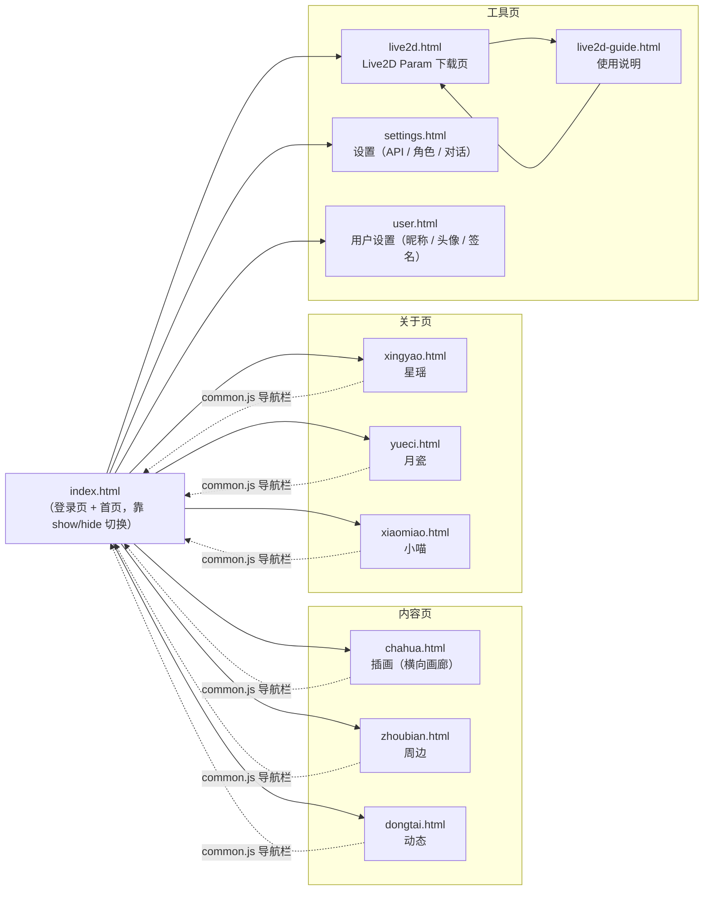
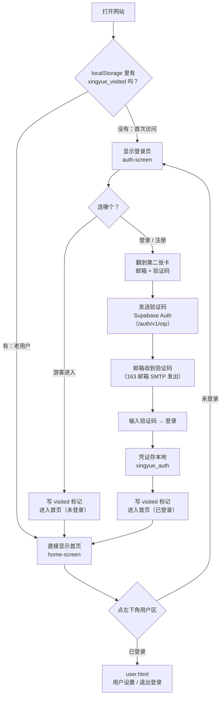
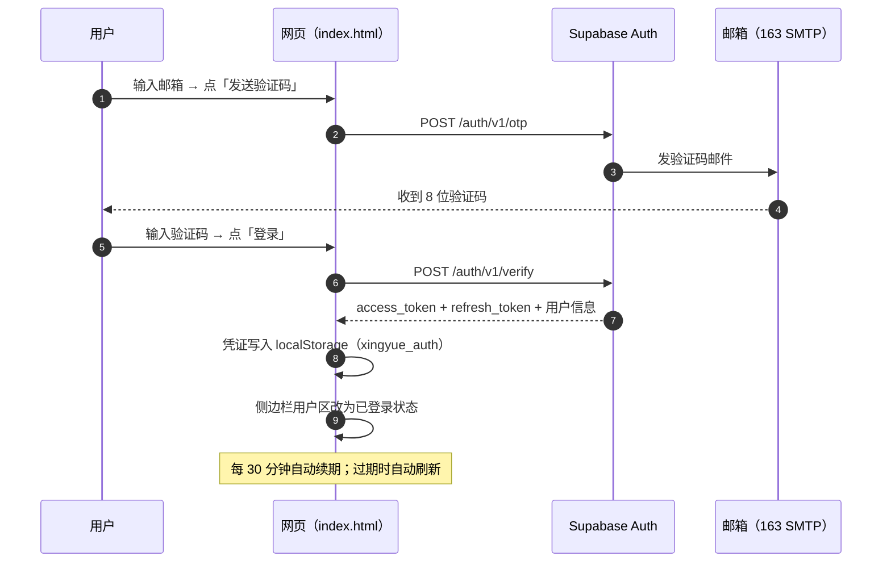
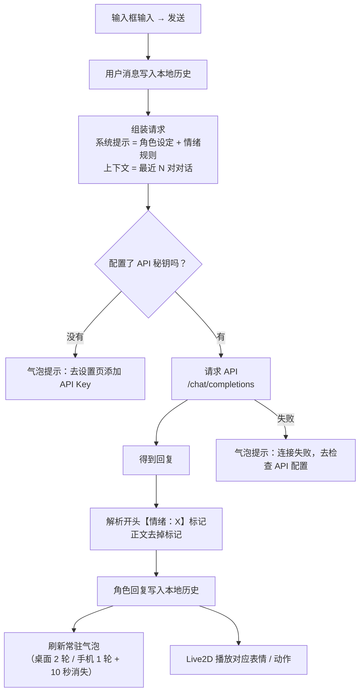
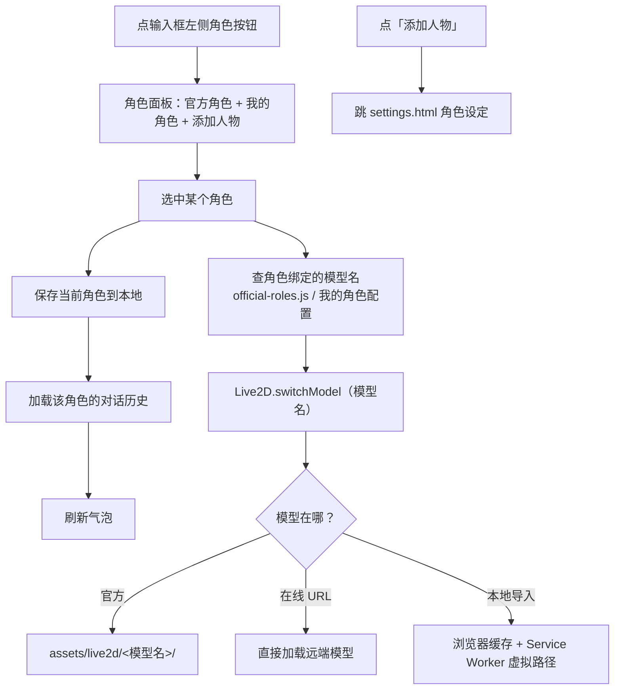
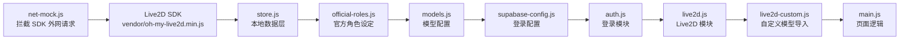
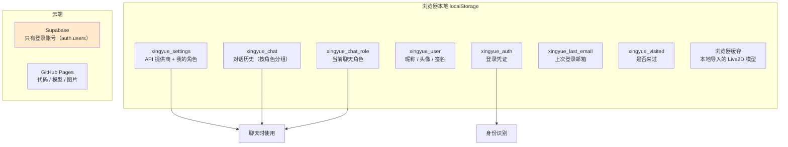

# 网站流程图（现状版）

> 用途：大改之前先把**当前流程**画清楚，方便对着图讨论「哪里要改、改成什么样」。
> 图都用 Mermaid 画，在 GitHub 上打开本文可以直接看到渲染后的图。
> 最后更新：随代码同步（改流程时记得回来更新本文）。

---

## 一、全站页面地图

**说明**：子页面共用 `assets/js/common.js` 注入的顶部导航栏（当前页面自己的入口会自动隐藏）；首页的入口在**左侧浮动侧边栏**里。

---

## 二、进入网站的流程（首次 / 老用户 / 登录 / 游客）

**关键点**：
- `visited` 只是「来过一次」的本地标记，**不代表已登录**（游客进入也会写）
- 老用户下次打开会**直接进首页**，要登录得自己点左下角用户区
- 登录页和首页是**同一个 HTML 文件**（`index.html`），靠 `display` 切换

---

## 三、登录流程（时序图）

**当前登录能力**：邮箱验证码登录 / 自动续期 / 退出登录（在 `user.html` 最下方）
**当前还没有的**：找回密码、第三方登录（GitHub/QQ）、登录才能用的功能限制

---

## 四、首页功能流程

### 4.1 聊天流程

**要点**：
- 对话历史**只存在浏览器本地**（按角色分组），换设备就没了
- 上下文长度由设置页「角色记忆的对话对数」决定
- 情绪标记是**约定格式**：LLM 必须输出 `【情绪：开心】…`，Live2D 表情靠它驱动

### 4.2 角色与模型

### 4.3 启动时的初始化顺序

---

## 五、数据都存在哪

**当前状态**：**除了登录账号，其它数据全在本地**（换设备/清缓存 = 全部消失）

---

## 六、流程里的「可改动点」（大改前先看这个）

| # | 现状 | 可以怎么改 |
| --- | --- | --- |
| 1 | 登录页和首页挤在一个 `index.html`，靠 `display` 切换 | 拆成两个页面，或用前端路由（hash 切换），代码更好维护 |
| 2 | **游客和登录用户能做的事几乎一样**（登录只是显示名字） | 加权限分层：未登录只能试聊 N 句 / 不能改角色 / 有广告位… |
| 3 | 老用户下次打开**跳过登录页**（visited 标记） | 改成"必须登录"，或"每次都显示登录页但记住账号" |
| 4 | 聊天记录只在本地 | 登录后同步到 Supabase 数据库（多设备同一份对话）|
| 5 | 用户资料（昵称/头像）只在本地 | 绑定到账号，换设备也能带过去 |
| 6 | 访客没有账号概念 | 加"注册"的独立流程（现在注册和登录是同一套 OTP）|
| 7 | 侧边栏菜单硬编码在 `index.html` | 改成数据驱动（像 `common.js` 那样），以后加页面只改一处 |
| 8 | 子页面之间是普通跳转，没有统一框架 | 保持轻量（零构建），但可以抽公共模板 |
| 9 | 只有一个"官方角色 + 我的角色"概念 | 可以扩展：角色商店 / 分享角色 / 导入别人的角色卡 |
| 10 | 聊天是纯文字 | 可以加语音（TTS 朗读 + 唇形同步，Live2D 已预留 LipSync 分组）|

---

## 七、相关文档

- `docs/01-网站定位.md`：这个站是做什么的
- `docs/02-网站结构.md`：目录与文件职责
- `docs/03-协作指南.md`：首次环境准备
- `docs/04-双人协同操作手册.md`：Git 协同与冲突处理
- `docs/05-AI协作约定.md`：人 + AI 协作的分工与指令模板
- `docs/06-网站流程图.md`：本文（现状流程图 + 可改动点）
